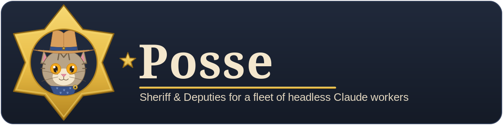

<p align="center">
  
</p>

# Posse

> **Posse lets one operator run many Claude or Codex tasks without babysitting terminals: each request becomes a durable case whose work and history persist across agent restarts, long jobs, and follow-up messages.**

Command-line agents are easy to start but hard to operate as a group. Processes die. Providers impose usage limits. A long computation may outlive its agent. With several tasks active, the operator loses a clear picture of what is running.

Posse surrounds each agent with durable state and background services. A router assigns work. A watchdog restores stopped agents. Job services keep detached computation alive, while a local dashboard shows what is running.

Posse operates the Claude Code CLI through your account. It can also operate the Codex CLI when configured. Posse does not provide an AI model.

Posse fits one trusted operator who runs long-lived agent work on Linux.

It is self-hosted and single-tenant. Posse is not a hosted service. It does not provide per-user permissions or a sandbox.

> [!CAUTION]
> **The agents Posse launches execute shell commands and edit files without waiting for approval.** Posse launches Claude Code with its permission checks bypassed. Run it only on a machine and in repositories where you accept that level of access.
>
> **Autonomous runs consume paid or quota-limited model access.** They draw from a provider subscription allowance; API-key runs are billed by token. Each agent restart or scheduled run uses more of that allowance or incurs more API charges without asking.

## The vocabulary

| Term | Plain meaning |
| --- | --- |
| **Operator** | The person who installs Posse and receives its updates. The operator also submits the work. |
| **Case** | One numbered work thread. It keeps the request with its follow-ups and result. |
| **Deputy** | The Claude or Codex agent process assigned to a case. |
| **Precinct** | A project or work domain. Each precinct owns model defaults and durable case history. |
| **Receptionist** | The built-in front desk for a request that names no precinct. |
| **Sheriff** | The system manager for records and policy changes. |
| **Judge** | A separate agent that reviews a deliverable and returns `SIGN-OFF`, `REVISE`, or `REJECT`. |
| **JTF** | A joint task force: one lead coordinates collaborators on the same task. |

The repository ships one built-in precinct: the Receptionist. You define your projects as precincts. For example, `backend` could be one precinct and `evaluation` another.

## From request to result

1. You create a case from the dashboard or email the Posse mailbox with a precinct tag.
2. The router starts a deputy in its own `tmux` session. The deputy receives the request and the precinct's standing context.
3. The deputy emails a plan before it works. It sends milestones during the work and reports the result at the end.
4. Replying to one of those emails steers the same case. Posse relaunches the deputy to read the message without stopping its detached jobs.
5. Posse keeps the conversation and result under the case number. Deliverables and Judge rulings remain attached to that record.

Assuming you created a precinct named `research`, this email starts a case:

```text
To: <your Posse mailbox>
Subject: [research] Compare the attached papers

Write a one-page comparison for our design review.
For each paper, identify its main result and one limitation.
Send the final report as a Markdown attachment.
```

The `[research]` tag chooses the precinct. A reply to the deputy's plan stays with the case that sent it.

The watchdog relaunches a deputy after a crash or after a reported usage limit resets.

For a long computation, the job manager parks the deputy instead of holding an agent session open. It wakes the deputy when the job ends. An optional GPU manager runs contended GPU work one job at a time.

A case can run on Claude or Codex. It may also assign different models to working and report writing. The installer requires Claude; Codex support is optional.

## Start with one case; add machinery only when needed

A first task needs only a precinct. The Field Guide applies automatically; the other features below are optional.

- **For consistent output, use the Field Guide.** Its standing instructions enter every deputy prompt. The shipped guide has two sections: **Code** and **Report**.

- **To change a standard, open a request.** The Sheriff owns Field Guide text. Each section offers a review request. A separate change box opens a Receptionist case. Neither action edits policy directly.

- **For independent approval, assign a Judge.** Posse archives each ruling. Once a case has a Judge, it remains open until that Judge signs off.

- **For parallel work on one outcome, create a JTF.** One lead coordinates numbered collaborators. Each slot has its own precinct and model settings.

- **For recurring work, use the Docket.** It saves a case or an entire JTF with a schedule. Entries may run once, hourly, daily, weekly, or monthly. Every occurrence submits new work and starts fresh deputies.

## Dashboard

The login-gated dashboard is the operator's view of the system.

**Public-release limit:** the web page cannot control an existing deputy. It cannot change the deputy's model or restart or stop its process. It cannot send a reply or add a collaborator to a JTF already in progress. Those missing buttons are intentional, not a setup error. Reply by email when you need to steer a deputy.

The available tabs are:

| Tab | What it does |
| --- | --- |
| **Status** | Shows live deputies and service health. Jobs and JTF membership appear beside the relevant deputy. |
| **History** | Opens past cases with their conversations and deliverables. Day trees and ancestor links preserve relationships. |
| **Precincts** | Shows one precinct's records and model defaults. This is also where you create a case. |
| **Judge** | Shows the installed reviewer roster and its rulings. A form opens work to propose another Judge. |
| **Field Guide** | Shows the Code and Report standards. Review requests and pending lessons appear here. |
| **JTF** | Creates a new joint task force. |
| **Docket** | Manages scheduled work. Run now starts a fresh submission. Pause takes an entry off the schedule; Edit changes it, and Cancel removes it. |

[dashboard/README.md](dashboard/README.md) covers deployment and environment variables. It also explains the security model and every tab.

## Requirements

You need a Linux host or WSL with Python 3.10, `bash`, `tmux`, `git`, and an authenticated Claude Code CLI.

Posse also needs a dedicated mailbox with IMAP and SMTP access. Gmail with an app password is the reference setup.

The dashboard has one operator login. Email commands pass through a fail-closed sender allow-list.

Bind the dashboard to localhost and use an SSH tunnel when possible. Its public mode uses a self-signed TLS certificate and belongs only on a trusted network.

## Install

[ONBOARDING.md](ONBOARDING.md) is the step-by-step installation and first-use guide. Read it before running the commands below.

Clone the repository and run the interactive installer:

```bash
git clone https://github.com/SheriffOreo/Posse.git
cd Posse
python3 setup.py
```

`setup.py` first checks the required tools and records the operator identity. It then connects the Posse mailbox and provider accounts. The last steps set the dashboard password before seeding the initial state and starting the services. The command prints the dashboard URL to open.

The installer is safe to rerun because it presents existing values as defaults. Use `python3 setup.py --no-launch` when you want configuration without startup.

After installation, start or stop the management services from the repository root:

```bash
bash posse_start.sh             # start or verify all services
bash posse_start.sh --gpu       # include the optional GPU manager
bash posse_stop.sh              # leave deputies and detached jobs running
```

Both scripts are idempotent and accept `--dry-run`.

Some internal names still use `infra`. In this repository, `infra` means the Posse runtime; it is not a second product or a different checkout. The runtime code lives in `infra/`. The dashboard session is named `infra_dashboard`.

`posse_start.sh` checks these `tmux` sessions:

| Session | Responsibility |
| --- | --- |
| `jobmgr` | Tracks detached jobs and wakes the deputy that submitted them. |
| `sheriff` | Maintains precinct records and decides governed change requests. |
| `docket` | Starts Docket entries when their scheduled time arrives. |
| `inbox` | Reads allowed email and routes new submissions or replies. |
| `watchdog` | Detects a stopped deputy and relaunches it when appropriate. |
| `infra_dashboard` | Serves the web dashboard. |
| `gpu_manager` | Optionally runs queued GPU jobs one at a time. |

## Update an existing install

Read the newest [CHANGELOG.md](CHANGELOG.md) entry before updating. It names any release-specific action.

Then pull the code and restart the long-lived services:

```bash
git pull --ff-only
bash posse_stop.sh
bash posse_start.sh
```

Add `--gpu` to both lifecycle commands if you use the GPU manager. A Docket entry fires only while the `docket` session is running, so any update that adds Docket must run `posse_start.sh` at minimum.

## Where Posse keeps its files

Posse runs from the cloned repository; `setup.py` does not copy its services elsewhere. Keep the checkout in place while Posse is running.

Runtime state defaults to `infra/scratch_full_logs/`. To put it elsewhere, set `INFRA_STATE_ROOT` in the generated `infra_env.local.sh`.

Credentials and dashboard authentication data stay outside tracked source. Do not share `~/.smtp_env`, `~/.anthropic_key`, `~/.claude/.credentials.json`, `~/.openai_key`, `~/.codex/auth.json`, or `dashboard/instance/`.

## License

Posse is released under the [Apache License 2.0](LICENSE). You may use, modify and redistribute it, including commercially, provided you keep the license and copyright notices and state what you changed. The license also grants you the contributors' patent rights, and withdraws that grant from anyone who starts patent litigation over the software. It comes with no warranty.

## Repository map

For the architecture and its design rationale, read [design/POSSE_DESIGN.pdf](design/POSSE_DESIGN.pdf).

```text
Posse/
├── infra/             core services and deputy machinery
├── dashboard/         web application
├── assets/            brand graphics
├── design/            architecture paper and source
├── setup.py           interactive installer
├── posse_start.sh     service startup
├── posse_stop.sh      management-service shutdown
├── infra_env.sh       configuration template
├── ONBOARDING.md      installation and first-use guide
├── CHANGELOG.md       release notes
└── VERSION            current release number
```
