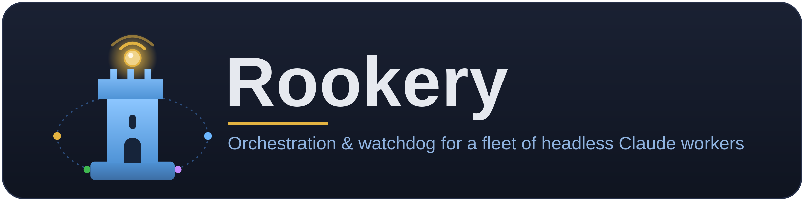
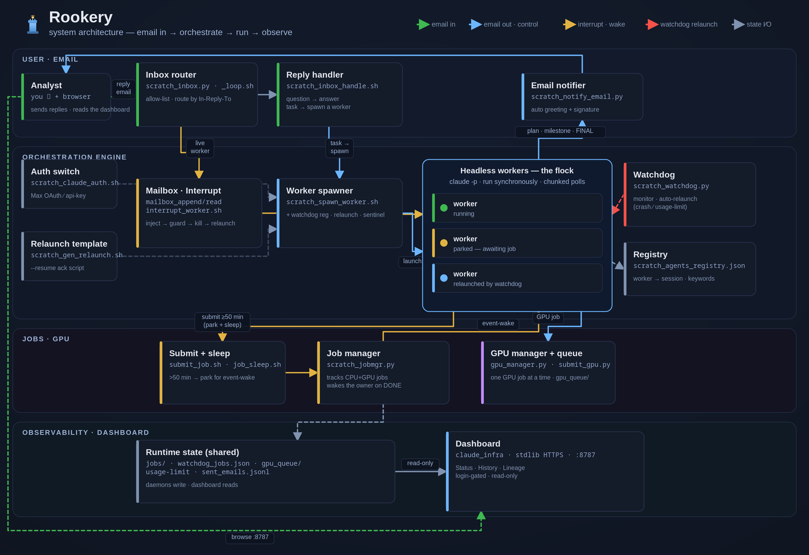

<p align="center">
  
</p>

<p align="center">
  <em>Orchestration &amp; watchdog for a fleet of headless Claude workers.</em>
</p>

<p align="center">
  
  
  
  
</p>

---

**Rookery** is the infrastructure that runs a colony of autonomous **Claude Code**
worker agents for the `time-series-omp` research project. You email a task; a worker
is spawned to do it, runs to completion, and emails you back its plan, milestones,
and result. If a worker crashes or hits a
usage limit, a watchdog brings it back. If a job will take an hour, the worker hands
the wait to a job manager and is woken the moment it finishes. A read-only web
dashboard lets you watch the whole colony.

> The name: a *rookery* is the nesting colony where a flock roosts — here, the flock
> of headless workers. A **rook** is also a watchtower, which is what the watchdog and
> job manager do: keep vigil and never let a worker stay down.

> **Code vs. state.** This repo is the **versioned home for the code**. The **runtime
> state** (logs, mailboxes, job records, the GPU queue, registries) is large and
> machine-local; it lives in the working directory the daemons operate on
> (`INFRA_STATE_ROOT`, default `/home/steven/Projects/time-series-omp`) and is
> git-ignored. See [`MIGRATION.md`](MIGRATION.md) for the split and the deferred cutover.

## Why this exists

Long research tasks don't fit in a single chat turn, and a headless `claude -p`
process has no scheduler behind it: background a job and end the turn and the job
dies with the process. Rookery is the missing runtime — it makes agents **durable**
(kept alive across crashes and usage limits), **reachable** (email interrupts a
running worker mid-task), **patient** (long jobs sleep cheaply and wake on an event
instead of burning tokens polling), and **observable** (one dashboard over the whole
fleet). It was hardened by a real, expensive lesson: undisciplined polling once cost
~$10k/month in cache rewrites, so the wait discipline below is load-bearing, not
decoration.

## Features

- 📨 **Email is the control plane.** Reply to a worker to steer it; a new task email
  spawns a new worker. An allow-list gates senders; replies route by `In-Reply-To`.
- ⚡ **Email interrupts a running worker.** A mid-task reply is injected into the
  worker's mailbox and the worker is surgically relaunched to read it — no waiting for
  the current step to finish.
- 🛡️ **A watchdog keeps the colony alive.** Crashed workers relaunch immediately;
  usage-limit-blocked workers relaunch after the reset. Nothing stays dead silently.
- ⏳ **Event-wake for long jobs.** A worker submits a >50-min job and *sleeps*; the job
  manager wakes it the instant the job finishes. Short jobs use ≤4-min foreground
  polls so every poll is a **cache-warm read** instead of a cold context rewrite.
- 🎛️ **One GPU, queued fairly.** A GPU manager runs a single GPU job at a time from a
  file-backed queue; jobs survive the owner being interrupted.
- 👁️ **Read-only dashboard.** Login-gated, pure-stdlib web UI: live Status, a
  job-history calendar, per-task conversations, and task lineage — day/night themed.
- 🔐 **Secrets never touch git.** SMTP creds, API keys, OAuth tokens, and the login
  hash all live outside the repo; a download sandbox + denylist guard the dashboard.

## Architecture

<p align="center">
  
</p>

The system is four cooperating lanes. A reply **email** hits the **inbox router**,
which either delivers it to a **live worker's mailbox** (via the interrupt entrypoint)
or hands a new task to the **reply handler**, which **spawns a worker**. Workers run
**synchronously**, email their **plan / milestone / FINAL**, and — for a long job —
**submit + sleep** so the **job manager** can event-wake them on completion (GPU work
rides the **GPU manager**). The **watchdog** monitors and relaunches every worker; the
**registry** maps worker→session; the **auth switch** picks billing. Every daemon
writes **runtime state**, which the **dashboard** reads to render Status / History /
Lineage.

| Component | File (`infra/`) | Role |
| --- | --- | --- |
| **Email notifier** | `scratch_notify_email.py` | Outbound email to the requester (greeting/signature auto-added); logs every send. |
| **Inbox reader** | `scratch_inbox.py` | Fetch/route replies (allow-list only), capture attachments, defer on usage-limit, route by `In-Reply-To`. |
| **Inbox router** | `scratch_inbox_loop.sh` | Always-on (`tmux inbox`). Delivers each reply to the live worker's mailbox, or dispatches a handler. |
| **Reply handler** | `scratch_inbox_handle.sh` | Triage: question → answer inline; task → write a spec and spawn a persistent worker. |
| **Mailbox** | `scratch_mailbox_append.sh` · `scratch_read_mailbox.sh` | Flock-safe, origin-headered channel for live mid-task feedback. |
| **Interrupt entrypoint** | `scratch_interrupt_worker.sh` | One call: inject → guard-stamp → surgical-kill → relaunch → verify. |
| **Relaunch template** | `scratch_gen_relaunch.sh` | Generates each worker's `--resume` relaunch script (origin-aware ack, death forensics). |
| **Worker spawner** | `scratch_spawn_worker.sh` | Launch a persistent `tmux` worker (+ watchdog registration, relaunch script, done-sentinel). |
| **Watchdog** | `scratch_watchdog.py` | Always-on (`tmux watchdog`). Detect killed / limit-blocked workers, email, auto-relaunch. |
| **Job manager** | `scratch_jobmgr.py` | Always-on (`tmux jobmgr`). Track all CPU+GPU jobs; event-wake the owner on completion. |
| **Job submit / sleep** | `scratch_submit_job.sh` · `scratch_job_sleep.sh` | Launch a >50-min job, then park the owner for an event-wake. |
| **GPU manager** | `gpu_manager.py` · `submit_gpu.py` | Always-on (`tmux gpu_manager`). One GPU job at a time from `gpu_queue/`. |
| **Registry** | `scratch_agents_registry.json` | Worker → session-id + reply-routing keywords + description. |
| **Auth switch** | `scratch_claude_auth.sh` | Sourced by every launcher; Claude Max OAuth (default) vs. API-key billing. |
| **Dashboard** | `dashboard/` | Login-gated, read-only, stdlib HTTPS UI over the live state. |

## Quickstart

Everything is Python 3.10 + bash; the dashboard needs **no pip installs**. Point the
daemons at the state directory with `INFRA_STATE_ROOT` (default shown).

```bash
export INFRA_STATE_ROOT=/home/steven/Projects/time-series-omp

# Always-on daemons (each idempotent / flock-guarded):
bash infra/scratch_jobmgr_start.sh          # tmux: jobmgr   — job manager
bash infra/scratch_gpu_manager_start.sh     # tmux: gpu_manager — GPU queue
bash infra/scratch_inbox_loop.sh            # tmux: inbox    — email router
#   (watchdog runs in tmux: watchdog — see MIGRATION.md for a manual bounce)

# Read-only dashboard:
cd dashboard
python3 set_password.py                      # one-time: set the login password
bash start_dashboard.sh                      # tmux: infra_dashboard → http://127.0.0.1:8787
#   public host, no tunnel (binds 0.0.0.0 + self-signed TLS):
#   INFRA_DASH_PUBLIC=1 bash start_dashboard.sh   → https://<host>:8787
```

From your laptop, reach the localhost dashboard over an SSH tunnel:

```bash
ssh -L 8787:localhost:8787 <host>     # then browse http://localhost:8787
```

Key env vars: `INFRA_STATE_ROOT` (state dir the daemons read/write), `INFRA_DASH_PORT`
(default `8787`), `INFRA_DASH_PUBLIC=1` (bind `0.0.0.0` **and** enable TLS). Full list
in [`dashboard/README.md`](dashboard/README.md). Today the daemons run from the tsomp
checkout; running them *from this repo* is a one-time cutover — see
[`MIGRATION.md`](MIGRATION.md).

## Design principles

- **Workers run synchronously.** A headless worker never backgrounds a job and ends
  its turn (that would orphan the job). It runs each batch in the foreground and only
  ends its turn to park on an event-wake.
- **Email can interrupt anything.** Steering a worker doesn't wait for a convenient
  moment — a reply injects into its mailbox and relaunches it now.
- **Wait cheaply.** > 50 min → hand the wait to the job manager and sleep (one wake
  costs one context rewrite). ≤ 50 min → foreground-poll at ≤ 4-min intervals so every
  poll lands inside the 5-min prompt-cache TTL as a warm read. This threshold is where
  polling cost and event-wake cost break even.
- **The watchdog is the backstop.** Every worker is registered and monitored; a crash
  or a usage-limit block is detected and reversed automatically.
- **Observability is read-only and free.** The dashboard only ever *reads* state —
  it makes no Claude/Anthropic API calls and spawns no processes, so it runs
  unattended at zero token cost.

## Repository layout

```
claude_infra/
├── assets/               # brand: logo (SVG/PNG) + the system-architecture figure
├── infra/                # the core daemon + helper scripts (byte-identical copies)
├── dashboard/            # login-protected, read-only status/history dashboard (stdlib)
├── proposed_patches/     # design notes for changes NOT yet applied to live infra
├── infra_env.sh          # INFRA_CODE_ROOT / INFRA_STATE_ROOT config (cutover + dashboard)
├── MIGRATION.md          # code/state split · path strategy · cutover · rollback
└── README.md             # this file
```

## Operating the daemons (sanctioned restarts)

These are the **only** approved ways to bounce a daemon (all idempotent):

```bash
bash infra/scratch_jobmgr_start.sh                                   # jobmgr
bash infra/scratch_gpu_manager_start.sh                              # gpu_manager
touch "$INFRA_STATE_ROOT/scratch_full_logs/inbox/RESTART_LOOP"       # inbox (graceful reload)
# watchdog: manual bounce only — see MIGRATION.md
```

## Dashboard

Login-protected, read-only, pure-stdlib. Live Status (workers / GPU / jobmgr /
usage-limit) + a job-history calendar → day → job/task → deliverable download, with
per-task conversation & lineage, in a day/night theme. Details and the security model
are in [`dashboard/README.md`](dashboard/README.md).

## Secrets — never committed

`~/.smtp_env`, `~/.anthropic_key`, `~/.claude/.credentials.json`, the dashboard
`instance/` (password hash + cookie secret + TLS cert), and the GitHub PAT in the git
remote are all **outside the repo** and covered by [`.gitignore`](.gitignore). The
code only ever *reads* them from those chmod-600 files; a secret scan guards every
commit.

---

<sub><b>Rookery</b> is the project name for this repo (`claude_infra` on disk).
Internal research infrastructure — no license granted; not for redistribution.</sub>
